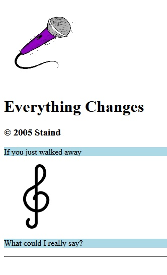

# Instructions

## Lab

Complete each portion of the lab with content from a song and artist of your choice. Each section will build upon the previous one so keep all of your code from the previous lab unless otherwise noted. All code will be written in the `index.html` file. If you have any problems reach out to the professor for assistance.

**Example Page:**

### Section 1

- HTML file with a page title set to **Assignment 02 Song Details**
- In the body define two paragraphs
  - First paragraph has the content set to the first line in the lyrics of your song.
  - Second paragraph has the content set to the second line in the lyrics of your song.

### Section 2

- Group the two paragraphs together by encapsulating(surrounding) them in a content division element.
- Add a style attribute to the content division element that colors the background `red`.
- Between the two paragraphs add an image element that has it's source set to `https://www.shareicon.net/data/128x128/2016/04/02/743522_music_512x512.png`.
- For each of the paragraphs add a style attribute to color their backgroud `lightblue`.
- After the second paragraph create a horizontal line, also called a thematic break.

### Section 3

- Add another content division element that encapsulates the current content division element
- Between the two content division elements create header of the highest/largest level with the content set to the song's title
- After the header create another header with the level of 3 that displays the copyright symbol followed by the year the song was written and who wrote the song. The copyright symbol should be implemented using the HTML entity value from the copyright symbol

### Section 4

- Add identifier attributes to each of the elements which give the element a short and unique reference name. Examples: `song-title`, `copyright`, `lyrics`, etc...
- Update the first header so that the text is strong/bold
- Update the two lyric paragraphs so that the text is italic
- Add a new paragraph after the horizontal line break and give it the text `You can't see me`
  - Add an identifier attribute to the paragraph
  - Make it so the paragraph is hidden on the rendered web page but still exists in the code
- Above the first header created in `Section 3` add a new image element that references the image path `./images/microphone.gif`

# Resources

## W3Schools

- [content division Element](https://www.w3schools.com/html/html_div.asp)
- [Copyright Symbol](https://www.w3schools.com/html/html_symbols.asp)
- [heading Element](https://www.w3schools.com/html/html_headings.asp)
- [hidden Property](https://www.w3schools.com/TAGS/att_hidden.asp)
- [HTML Styles](https://www.w3schools.com/html/html_styles.asp)
- [horizontal line Element](https://www.w3schools.com/tags/tag_hr.asp)
- [image Element](https://www.w3schools.com/html/html_images.asp)
- [id Attribute](https://www.w3schools.com/html/html_id.asp)
- [paragraph Element](https://www.w3schools.com/html/html_paragraphs.asp)
- [strong Element](https://www.w3schools.com/tags/tag_strong.asp)
